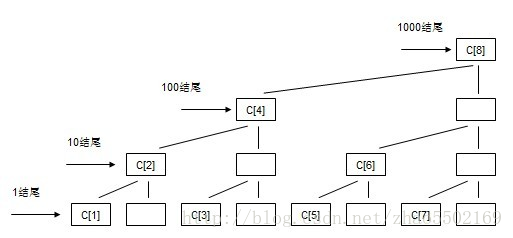

### BinaryIndexTree

树状数组的数据结构，利用二进制下标来进行维护的结构，其查询区间、单点更新的时间复杂度均为O(logN)，其结构图如下:

可以发现，每个位置表示的并不是当前位置的值，而是不同的层数，如果是在第一层的话，那么就是表示当前位置的值，如果是第二层的话，表示的是前一个和当前的值，同理第三层就是表示当前前面3个的值。故可以实现在logN下的查询。这里需要利用一个lowbit的运算。lowbit的作用是求出最低位的那个1，为什么这样可以求出来呢，是因为计算机中是采用补码的方式来存储数值型数据，所以负数的补码是原码取反再+1,一个二进制数取反后，后面如果现第一个1，那么这位将变为0，而他后面的0都取反为1，所以再+1，就是这位变为1，而他后面的都变为0，这样再与原来的数字进行与运算就能获得
这里有一个特殊的操作lowbit(x) = x&-x，通过这个操作我们就可以访问到上一层或则下一层，当我们需要去求前3项的和时，只需要向下执行i -= lowbit(i)的操作就行了，从图中你就会发现这正好就是前两项的和再加上第三个和，确实就是如此的巧妙，同理我们更新的时候就是不断向上去更新。因为这里就利用了二进制的巧妙，比如当我们在2的乘法的位置的数就就是前面全部的和然后它再减去它的lowbit就是0，因为他只有最高位是1，而非2的乘方的位置，他会一直向下去寻找，知道找到第一个乘方的位置，加起来就刚好是前n项的和。希望你能明白。
原文链接：https://blog.csdn.net/zhao5502169/article/details/75666740

